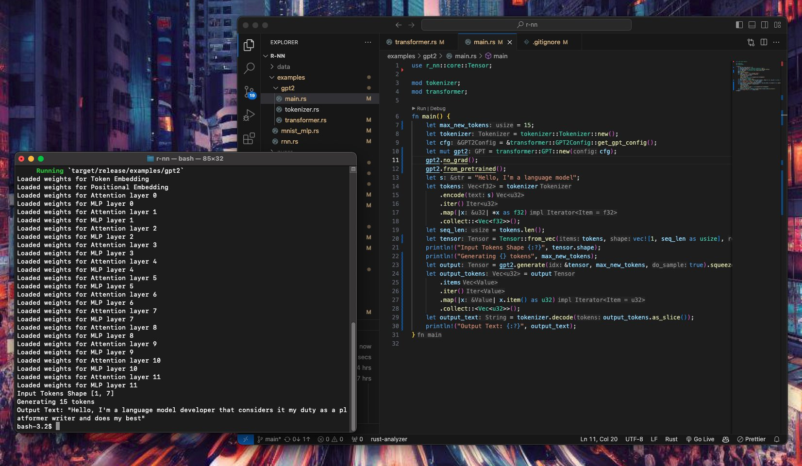

# r-nn

  

  
  

  

    

    r-nn running inference for GPT-2
    

  

   

`r-nn` is a Tensor library with fully supported Automatic Differentiation with an API modelled after [PyTorch](https://pytorch.org/) using only the standard library (`rand` and `rand-distr` crates are used only for weight initalization). The core backbone of `r-nn` is modelled after [micrograd](https://github.com/karpathy/micrograd) and works on scalar values (modelled as `Value` objects). A `Tensor` is a collection of `Value` objects woth support for the common PyTorch operations. `r-nn` is best used for educational purposes - to understand how Tensor operations works and the simplicity of backpropagation. It is fully tested against reference `PyTorch` implementations.

Often, it is hard to visualise how gradients work for large matrices. It turns out that by simply thinking of a matrix's gradient as being another matrix where each element in the gradient matrix is localised to an element in the original matrix simplifies the intuition. By only implementing `backward()` for `+`, `*`, `pow()`, `exp()` and `ln()`, it turns out that this is sufficient for basically all operations (including complex ones like `softmax` and `tanh`). 

For a matrix multiplication of `A @ B`, the local gradient of `A` is `B` transposed and vice versa. This is not particularly obvious at first and `r-nn` does not need to implement that at all but is still able to generalise for matrices of any arbitrary size. 

## Examples 
Examples can be found in the `/examples` folder, with examples for training a Multi Layer Perceptron, Recurrent Neural Network and running inference on GPT2. However, it is highly recommended to use `r-nn` for specifically educational purposes.

## Optimisations
For educational purposes, `r-nn` is written to be explicit, for example using the naive matrix multiplication algorithm (for most cases). It also saves all intermediate values. In the matrix multiplication example, this means it stores ~$3N^3$ intermediate values in addition to the matrix product. Each `Value` object is wrapped in a `Rc<RefCell>` which adds ~40 bytes of overhead to a single 32-bit floating point. 

Optimisations would thus involve moving away from thinking in terms of Scalar operations to Tensor values with a single pointer to each Tensor instead. Gradient manipulations would then happen at the Tensor level instead.

## References 
Acknowledgements go to the following codebases which were referenced:
 - [https://github.com/Based-ML/Tenso_rs](https://github.com/Based-ML/Tenso_rs)
 - [https://github.com/danielway/micrograd-rs/](https://github.com/danielway/micrograd-rs/)
 - [https://github.com/karpathy/micrograd](https://github.com/karpathy/micrograd)

